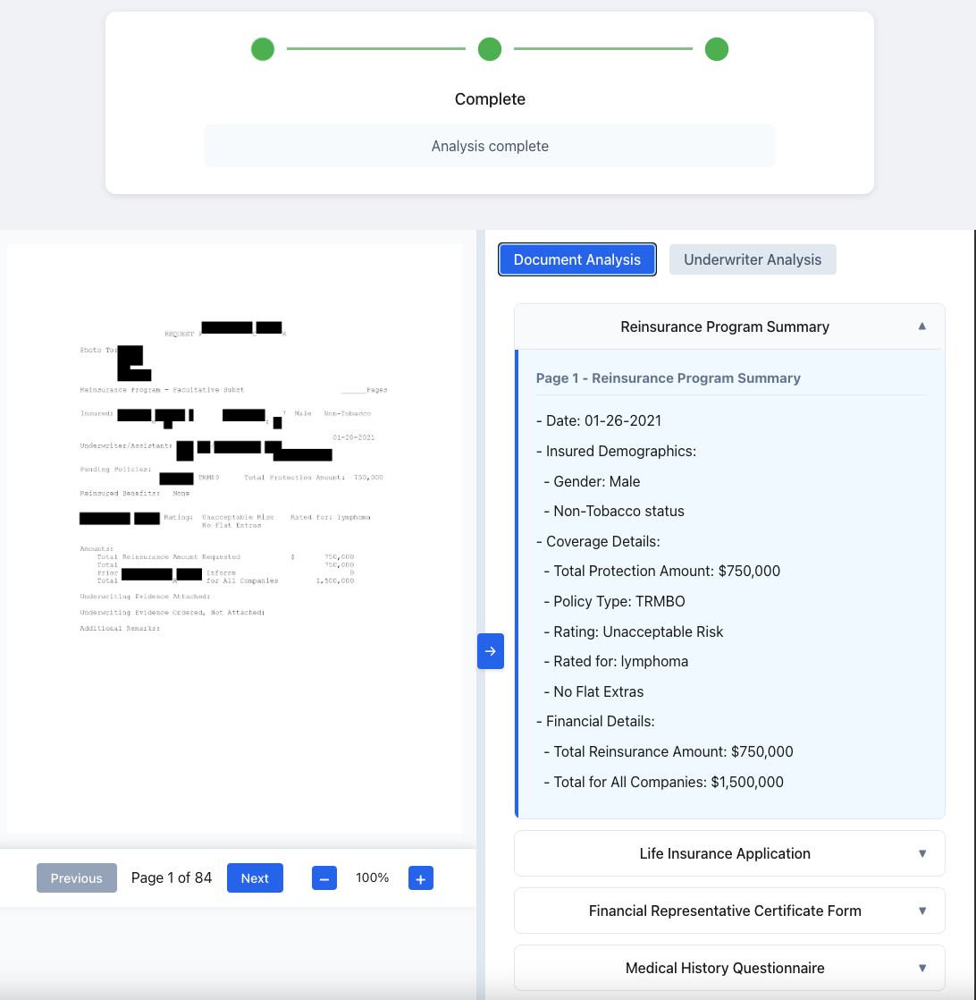

# genai-underwriting-workbench-demo

A demonstration project showcasing the power of Amazon Bedrock and advanced AI models like Claude 3.5 Sonnet in transforming life insurance underwriting workflows. This solution leverages intelligent document processing to streamline the underwriting process by automatically extracting, analyzing, and making accessible critical information from insurance applications and related documents.

## Business Purpose

This demo addresses a key challenge in life insurance underwriting: the time-consuming process of reviewing lengthy applications and related documentation. By combining Amazon Bedrock's capabilities with advanced AI models, the solution helps underwriters:

- Reduce time spent on manual document review
- Automatically extract and organize relevant information from complex documents
- Surface key insights and potential risk factors
- Enable natural language interaction with document contents
- Increase consistency in information extraction
- Allow underwriters to focus on decision-making rather than information gathering

## Key Features

### Document Analysis
- Page-by-page analysis of insurance applications and supporting documents
- Efficient batch processing of multiple pages at a time to optimize performance and resource usage
- Intelligent extraction of key data points from each page, enabling comprehensive analysis without token limitations
- Automatic classification of document sections with useful bookmarks



### Underwriter Analysis
- AI-driven analysis of the document to detect discrepancies and extract underwriting-relevant insights
- Evaluation of medical history, medications, and lifestyle factors to identify risk indicators
- Automated identification of potential risk factors and summary of key findings
- Highlighting of areas requiring additional review and cross-referencing of information across sections
- Optional integration with customer's proprietary underwriting manuals for specialized insights


### Chat Interface
- Natural language chat interface for querying document contents
- Context-aware responses leveraging the extracted document insights
- Persistent chat history ensuring coherent conversation flow
- Quick navigation to relevant document sections using markdown links
- Contextual understanding of underwriting terminology for detailed inquiries


## Deployment

The project is designed to be deployed on AWS using the AWS Cloud Development Kit (CDK) for a seamless deployment of both backend and frontend services along with all necessary AWS infrastructure.

### Prerequisites for Deployment

- **Docker**: Required for containerization
  - Install [Docker Desktop](https://www.docker.com/products/docker-desktop/) for your OS

- **AWS CLI**: Install and configure with your credentials:
  ```bash
  aws configure  # You'll need access key, secret key, default region (us-east-1 recommended)
  ```

- **Node.js and npm**: Ensure you have Node.js (version 14 or later) and npm installed
  ```bash
  node --version  # Should be >= 14
  npm --version
  ```

- **AWS CDK**: Install globally:
  ```bash
  npm install -g aws-cdk
  cdk --version  # Verify installation
  ```

- **CDK Dependencies**: From the `cdk` directory, install necessary packages:
  ```bash
  cd cdk
  npm install
  ```

### Bootstrap and Deploy the CDK Stack

1. If necessary, bootstrap your AWS environment (required once per account/region):
```bash
cd cdk
cdk bootstrap aws://ACCOUNT-NUMBER/REGION  # Replace with your AWS account number and region
```

3. Deploy the stack:
```bash
cdk deploy
```

This process will:
- Create all necessary AWS resources (Fargate clusters, Load Balancers, DynamoDB tables, S3 buckets, etc.)
- Create ECR repositories and push Docker images
- Deploy backend services and the frontend application
- Output API endpoints and frontend URLs once complete

**Note**: Ensure your AWS account has appropriate permissions to create and manage these resources, including:
- ECR repository creation and push permissions
- ECS/Fargate cluster management
- DynamoDB table creation
- S3 bucket management
- IAM role and policy management
- CloudFormation full access


## Technical Overview

The project consists of three main components:

- **Backend**: A Flask-based API written in Python which:
  - Accepts PDF uploads via the `/analyze` endpoint
  - Converts PDF pages to images using `pdf2image`
  - Processes documents in efficient batches to extract key information
  - Maintains a structured representation of document contents for quick retrieval
  - Leverages Amazon Bedrock and Anthropic's Claude models for:
    - Detailed page-by-page analysis
    - Extraction of underwriting-relevant data
    - Generation of aggregated insights
    - Interactive Q&A capabilities using extracted document context
    - Optional knowledge base integration for specialized queries

- **Frontend**: A React application (powered by Vite) that provides:
  - Document upload interface with progress tracking
  - Visual representation of extracted information
  - Interactive chat interface for querying document contents
  - Organized display of underwriting insights
  - Seamless document reprocessing capabilities

- **Infrastructure**: Deployed via AWS CDK, which automates the provisioning and management of all cloud resources.

## Development Setup

For local development, follow these steps:

### Backend
1. Ensure you have Python 3.8+ installed.
2. Install required Python packages:
   ```bash
   pip install -r backend/requirements.txt
   ```
3. Install system dependencies:
   - `pdf2image` requires [Poppler](https://poppler.freedesktop.org/):
     ```bash
     # macOS
     brew install poppler

     # Ubuntu
     sudo apt-get install poppler-utils
     ```
4. Start the Flask server:
   ```bash
   python backend/app.py
   ```
   The server will run in debug mode at [http://localhost:5000](http://localhost:5000).

### Frontend
1. Navigate to the frontend directory and install dependencies:
   ```bash
   cd frontend
   npm install
   ```
2. Start the development server:
   ```bash
   npm run dev
   ```
3. Open [http://localhost:5174](http://localhost:5174) (or the port shown in your terminal) in your browser.

## API Usage

The backend provides an API endpoint for document analysis:

**POST** `/analyze`
- Request: multipart/form-data
  - `file`: PDF document to analyze
  - `batch_size` (optional, default: 3): Number of pages to process per batch
  - `page_limit` (optional): Maximum number of pages to analyze

Example:
```bash
curl -F "file=@/path/to/document.pdf" -F "batch_size=3" -F "page_limit=10" http://localhost:5000/analyze
```

Response includes:
- `page_analysis`: Detailed per-page analysis
- `underwriter_analysis`: Aggregated insights and key findings