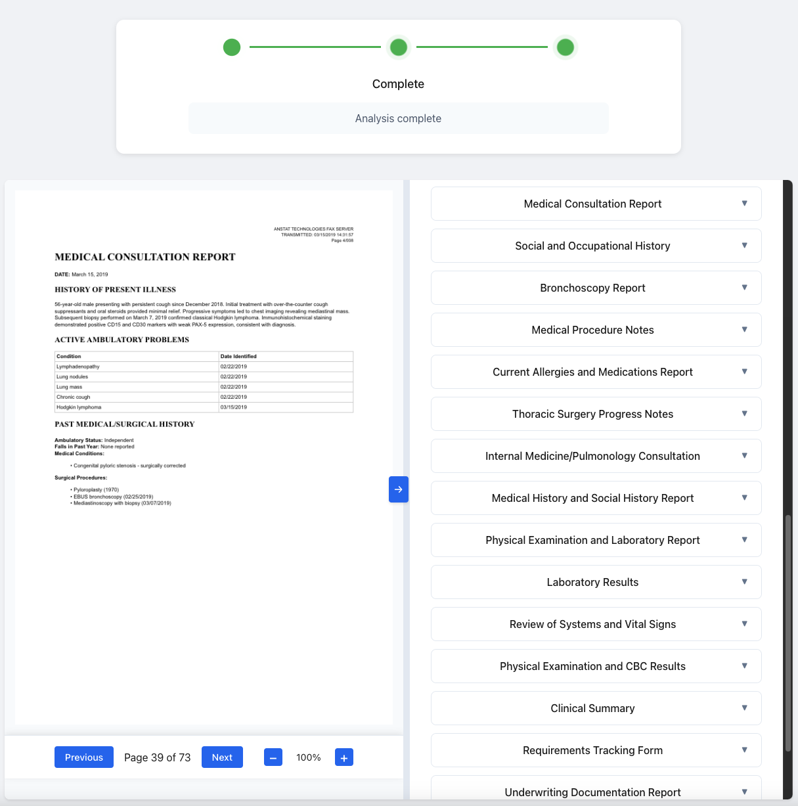
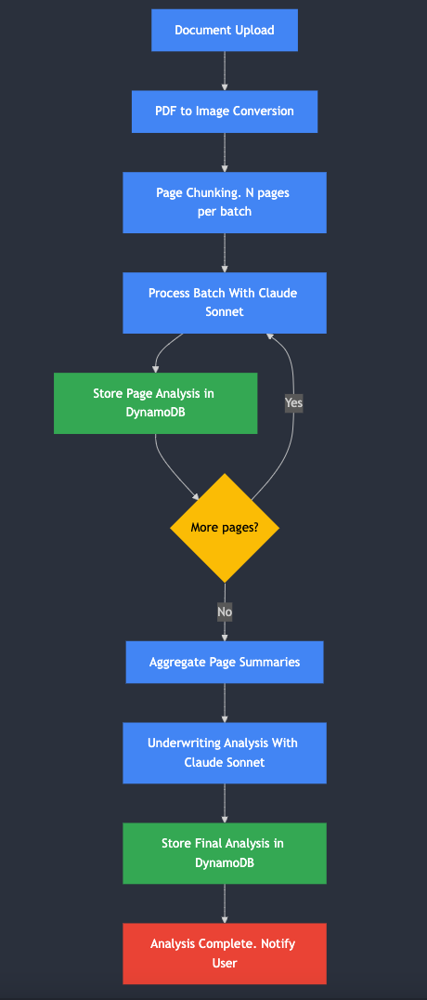
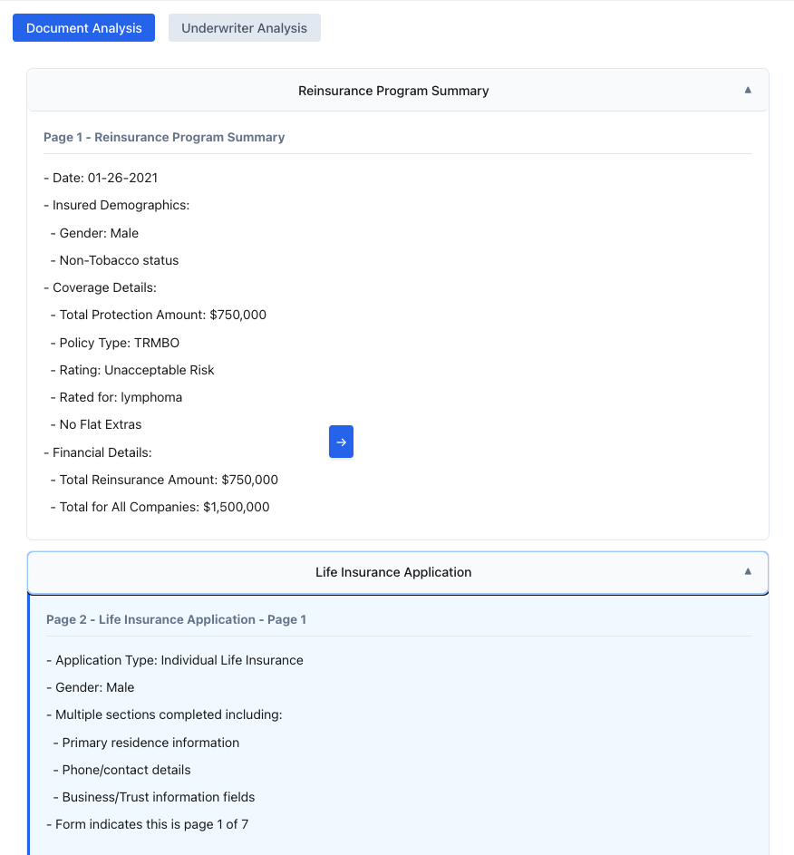
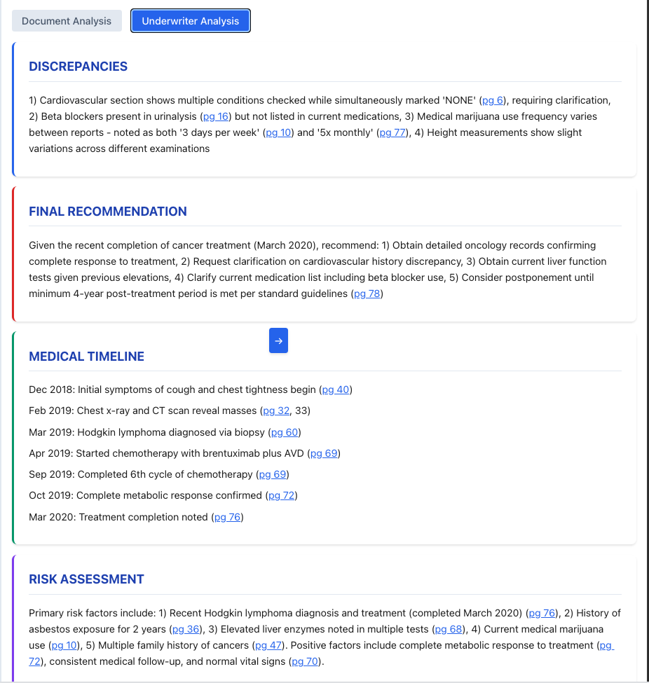

# GenAI Underwriting Workbench - Sales Field Guide

## Overview

The GenAI Underwriting Workbench is a powerful demonstration of how Amazon Bedrock and Claude's advanced AI capabilities can revolutionize insurance underwriting across both Life and Property & Casualty (P&C) lines of business. This field guide will help you effectively showcase this solution to potential clients by explaining its features, benefits, and walking through a compelling demonstration.

**Target Audience:** Insurance companies, including both life and P&C insurers, particularly underwriters, IT decision makers, and innovation leaders looking to improve efficiency and accuracy in their underwriting process.

## Business Problems Addressed

### The Underwriter's Dilemma: A Day in the Life

Meet Sarah, a senior underwriter at a mid-sized insurance company. Her day begins with a familiar sight: a stack of applications waiting for review, each containing dozens or even hundreds of pages of documentation. For a typical life insurance case, she'll need to review 50-100+ pages of medical records, lab reports, and questionnaires. If she's handling P&C submissions, she faces complex ACORD forms, property inspections, and detailed claims histories.

Sarah sighs as she opens the first file. According to Accenture's 2021 industry report, she's not alone in her frustration—underwriters report spending a staggering 40% of their time on non-core administrative activities rather than applying their expertise to risk assessment. The culprits are painfully familiar: redundant data entry and manual processes (cited by 71% of underwriters), outdated systems that don't communicate with each other (40%), and critical information that isn't available when and where it's needed (36%).

As she digs into the application, Sarah must mentally piece together a coherent picture from fragments scattered across multiple documents. The applicant's medical history appears in one section, but related lab results are buried 30 pages later. Prescription information is in yet another document, with dosages that don't quite match what's mentioned in the physician's notes. She carefully builds a timeline on a separate notepad, trying to reconcile these discrepancies—a process she'll repeat dozens of times this week alone.

By mid-afternoon, Sarah has completed just two applications. The pressure is mounting as her queue grows longer. Her company, like many in the industry, is feeling the talent crunch—Accenture reports that the number of underwriting organizations with superior talent management capabilities has plummeted by 50% since 2013. With fewer experienced underwriters available and training programs struggling to keep pace, each team member must somehow process more applications without sacrificing accuracy.

The consequences ripple throughout the organization. Applications that should take days stretch into weeks. Customer satisfaction scores are declining as applicants grow frustrated with the wait. Agents are calling for updates, adding to the interruptions. Meanwhile, Sarah knows that somewhere in those hundreds of pages might lurk a critical piece of information that could change her risk assessment—but finding it feels like searching for a needle in a haystack.

This is the reality for underwriters across the insurance industry—skilled professionals spending most of their time on low-value administrative tasks rather than applying their expertise to risk assessment. The GenAI Underwriting Workbench was designed specifically to address these challenges.

## Key Value Propositions

The demo highlights these key benefits:

1. **Efficiency**: Reduce document review time by 70-80% through automated extraction and organization
2. **Accuracy**: Ensure no critical information is missed through comprehensive AI analysis
3. **Consistency**: Standardize the information extraction process across all applications
4. **Insight Generation**: Automatically identify risk factors, discrepancies, and create medical timelines
5. **Interactive Experience**: Enable underwriters to ask natural language questions about applications

## Key Features

### Intuitive Split-Screen Interface

The solution provides an efficient dual-pane interface that streamlines the underwriting workflow:

#### Document View and Navigation

The left panel shows the original document, allowing underwriters to:
- View the source material exactly as submitted
- Navigate quickly between pages
- Verify extracted information against the original content
- See highlighted sections that correspond to the analysis

#### Analysis and Insights (Right Panel)

The right panel organizes all extracted insights into three practical tabs:

##### 1. Document Analysis

This tab presents a structured view of the document contents:
- Automatically identifies and categorizes different document types (applications, medical records, ACORD forms)
- Extracts and organizes key information by section
- Provides direct links between extracted data and source pages
- Highlights critical information and potential risk factors

##### 2. Underwriter Analysis

This tab synthesizes the information into actionable insights:
- Comprehensive risk assessment with supporting evidence
- Medical timeline or property lists. 
- Automated discrepancy detection across documents
- Clear recommendations for next steps

##### 3. Interactive Chat Assistant

This tab enables natural conversation with the documents:
- Ask questions in plain English about any aspect of the submission
- Get precise answers with direct links to source pages
- Follow up with clarifying questions
- Explore complex relationships across multiple documents

### Business Benefits

This interface design delivers immediate value by:
- Eliminating time wasted switching between documents and systems
- Ensuring thorough analysis through automated extraction and organization
- Reducing the risk of missing critical information
- Enabling faster, more confident decision-making

## Audience-Specific Approaches

Tailor your demonstration based on your audience's role and priorities:

### For Underwriters & Business Teams

**Focus on:**
- Reduction in manual work (highlight Document Analysis and Medical Timeline features)
- Ease of finding specific information (demonstrate Chat Assistant with relevant examples)
- Information verification (show how page references link to source documents)
- Integration with current workflows

**Key messages:**
- "This solution handles the administrative burden of document processing so you can focus on applying your expertise to risk assessment."
- "No more searching through hundreds of pages to find critical information—everything is organized and searchable."
- "The system never makes the final decision—it simply provides the information you need more efficiently."

### For IT Leadership

**Focus on:**
- Architecture and AWS service integration
- Security and compliance considerations
- Deployment flexibility and customization options
- Implementation timeline and resource requirements

**Key messages:**
- "The solution is built on secure, scalable AWS services like Amazon Bedrock, minimizing operational overhead."
- "All processing occurs within your AWS environment, ensuring data sovereignty and security."
- "The API-first design makes integration with existing systems straightforward."
- "Amazon Bedrock provides enterprise-grade security controls and compliance features built-in."

### For Executive Stakeholders

**Focus on:**
- Business impact metrics and ROI
- Competitive advantages
- Implementation timeline
- Success stories and case studies

**Key messages:**
- "This technology can dramatically reduce application processing time, improving both operational efficiency and customer experience."
- "As competitors adopt similar technologies, staying competitive requires modernizing underwriting workflows."
- "The solution is designed for incremental adoption, allowing you to see ROI quickly while scaling over time."
- "Amazon Bedrock provides enterprise-ready AI capabilities without the need for specialized ML expertise or infrastructure."

## Quick Demonstration Paths

Depending on the time available, follow these streamlined demonstration paths:

## Demo Walkthrough

Follow this step-by-step guide to demonstrate the solution effectively:

### 1. Login & Home Page

- Note the insurance type toggle at the top of the page that allows switching between Life and P&C insurance modes
- For live demos:
  - Select the appropriate insurance type based on your audience (Life or P&C)
  - Use the "View Demo Document" option to avoid processing delays
- If uploading a document, explain that:
  - The system accepts PDFs of any length
  - Processing time depends on document size (approximately 1 minute per each batch of 3-5 pages)
  - The system handles various document types based on the selected insurance type:
    - Life: Applications, medical records, lab reports, pharmacy records
    - P&C: ACORD forms, property inspections, claims history, valuations

**Talking Points**: 
For Life Insurance prospects: "The system uses Amazon Bedrock and Claude 3.5 Sonnet to understand complex medical documents, where both content and formatting carry critical meaning for risk assessment."

For P&C Insurance prospects: "The system leverages Amazon Bedrock and Claude 3.5 Sonnet to process ACORD forms and related documents, extracting property details and risk factors while maintaining the context of the submission."

### 3. Analysis Progress

- Explain the real-time processing display:
  - Document splitting and page-by-page analysis
  - Aggregation and underwriter analysis generation

**Talking Points**: "The system processes documents in two stages: first extracting detailed information from each page, then synthesizing this information into underwriting insights. This approach ensures no information is lost while enabling comprehensive analysis."

### 4. Document Analysis View

- When processing completes, highlight the split-view interface:
  - Left side: Original document with navigation controls
  - Right side: Analysis tabs with extracted information

- For the Document Analysis tab:
  - Show how sub-documents are automatically categorized by type
  - Demonstrate how clicking a document section navigates to the corresponding page
  - Highlight the collapsible sections that organize information

**Talking Points**: "The system automatically identifies document types and organizes information into logical sections, saving underwriters from manually sorting through pages. The side-by-side view allows instant verification of extracted information against the source document."

### 5. Underwriter Analysis Tab

- Switch to the Underwriter Analysis tab and highlight:
  - Risk Assessment with key findings and potential concerns
  - Medical Timeline showing chronological health events
  - Discrepancies section flagging inconsistent information
  - Final Recommendation summarizing next steps

- Demonstrate how clicking on page references instantly navigates to source pages

**Talking Points**: "This consolidated view provides insights that would typically take hours to compile manually. The system identifies potential risk factors, constructs medical timelines, and flags discrepancies across documents - all with direct links to source information for verification."

### 6. Chat Assistant Tab

- Switch to the Chat Assistant tab and demonstrate:
  - How underwriters can ask natural language questions about the document
  - The system's contextual understanding of insurance terminology
  - How answers include page references that link directly to source pages

- Example questions to demonstrate:
  For Life Insurance:
  - "What medications is the applicant currently taking?"
  - "Are there any discrepancies in the reported medical history?"
  - "When was the applicant first diagnosed with [condition]?"
  - "Summarize the laboratory results and highlight any abnormal values."

  For P&C Insurance:
  - "What are the property's key risk factors?"
  - "Summarize the claims history for this property."
  - "What safety systems are installed?"
  - "Are there any discrepancies in the reported property values?"

**Talking Points**: "This interactive capability transforms how underwriters work with documents. Rather than scanning dozens of pages to answer specific questions, they can simply ask and get precise answers with source references. This saves tremendous time while ensuring nothing is missed."

## Implementation and Integration

When discussing implementation with technical stakeholders:

- Emphasize the solution is built on AWS services, making integration straightforward for AWS customers
- Highlight the modular architecture that can be customized to specific business needs
- Mention the API-first design enabling integration with existing underwriting systems
- Note that the solution can be extended via Retrieval Augmented Generation (RAG) to incorporate company-specific underwriting guidelines, manuals and rules
- Emphasize Amazon Bedrock's serverless nature, which eliminates infrastructure management overhead
- Explain how Amazon Bedrock integrates with existing AWS security services like IAM, CloudTrail, and VPC endpoints

## Addressing Common Questions

Be prepared for these frequently asked questions:

**Q: How accurate is the information extraction?**  
A: Claude 3.5 Sonnet excels at understanding complex documents, achieving ~95% extraction accuracy in our testing. The system also provides direct links to source pages so underwriters can verify information instantly.

**Q: How does this handle personally identifiable information (PII)?**  
A: The solution is designed with privacy in mind. All processing occurs within your AWS environment, data can be encrypted at rest and in transit, and the system can be configured to redact or mask sensitive information as needed via Bedrock Guardrails. Amazon Bedrock includes controls to protect PII and sensitive information.

**Q: Can this be customized for our specific underwriting guidelines?**  
A: Absolutely. The system can incorporate company-specific underwriting manuals, risk assessment criteria, and business rules to provide tailored insights aligned with your underwriting philosophy. Amazon Bedrock's Knowledge Base and RAG capabilities make it easy to incorporate your proprietary information.

**Q: What's the typical implementation timeframe?**  
A: A proof of concept can be implemented in 2-4 weeks, with full production deployment typically taking 2-3 months depending on integration requirements and customizations.

**Q: How does this compare to traditional OCR or rules-based document processing?**  
A: Unlike traditional OCR, this solution understands context and meaning, not just text. It can interpret complex medical terminology, understand document structure without rigid templates, and make connections across different document sections—capabilities beyond traditional systems.

**Q: Can this solution process handwritten documents?**  
A: Yes, Claude 3.5 Sonnet has strong capabilities for processing handwritten content, though accuracy may vary depending on legibility. The solution performs best with typewritten content but can handle handwritten annotations and notes commonly found in medical records.

**Q: Where is our data processed and stored?**  
A: All processing occurs within your AWS account using Amazon Bedrock in your chosen region. Documents are stored in your own S3 buckets with encryption at rest, and all analysis is performed within your environment. No data needs to leave your AWS environment.

## Technical Requirements

For reference when speaking with IT stakeholders:

- The solution is deployed on AWS using AWS CDK for infrastructure-as-code
- Leverages Amazon Bedrock for the AI/ML capabilities with Claude 3.5 Sonnet
- Uses Amazon S3 for secure document storage with encryption at rest
- Employs Amazon CloudFront for global, low-latency content delivery
- Runs containerized workloads on AWS Fargate for scalable, serverless processing
- Utilizes Amazon DynamoDB for metadata and analysis results storage
- Requires minimal infrastructure management thanks to the serverless architecture
- Can be deployed in the client's AWS environment for data sovereignty

## Business Impact Metrics

When discussing ROI with executive stakeholders, highlight these potential metrics:

- **Time Savings**: Reduce document review time by 60-80% (from hours to minutes)
- **Increased Capacity**: Process 2-3x more applications or submissions with the same underwriting staff
- **Error Reduction**: Minimize oversights of critical information with comprehensive analysis
- **Faster Turnaround**: Reduce processing time from weeks to days or even hours
- **Improved Customer Experience**: Faster approvals lead to higher completion rates and customer satisfaction
- **Cost Reduction**: Lower operational costs through increased underwriter efficiency
- **Scalability**: Handle volume spikes without adding staff thanks to the elastic AWS infrastructure

## Solution Architecture

This section provides a high-level overview of how the solution works, which can be useful for explaining the technical foundation to prospects.

The solution uses a two-stage analysis approach:

1. **Page-Level Analysis**: Documents are processed in batches (typically 3-5 pages at a time) to extract detailed information from each page. This stage:
   - Converts PDF pages to high-quality images
   - Processes them with Claude's multimodal capabilities
   - Extracts structured information while preserving context
   - Produces detailed page-by-page summaries
   - Classifies documents into relevant categories (e.g., application, medical records, lab reports)

   

2. **Underwriter Analysis**: All extracted page data is synthesized into an overall assessment that includes:
   - Risk assessment with key findings
   - Medical timeline organization
   - Discrepancy identification
   - Underwriting recommendations

   

### AWS Services Powering the Solution

The underwriting workbench leverages several AWS services to deliver a secure, scalable, and responsive experience:

- **Amazon Bedrock**: Provides the AI foundation with Claude 3.5 Sonnet for document understanding and natural language interaction
- **Amazon S3**: Securely stores uploaded documents and analysis results with encryption at rest
- **Amazon CloudFront**: Delivers low-latency access to the web interface from anywhere in the world
- **AWS Fargate and ECS**: Runs containerized processing workloads without server management
- **Amazon DynamoDB**: Stores metadata and analysis results for quick retrieval
- **AWS IAM**: Ensures proper access control and security throughout the application